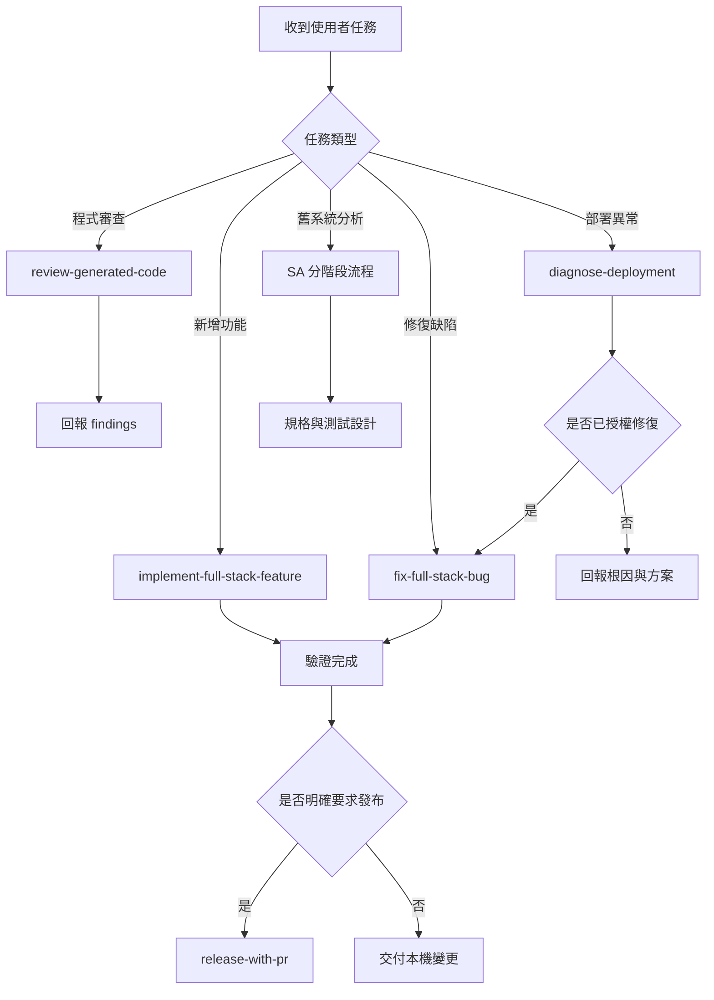

# 專案 Workflow 導覽

## 這份文件的用途

本文件是專案 AI 工作流程的統一入口。收到任務後先選擇一個主要 Workflow，再依任務需要載入專項 Skill；不得一次套用所有流程，也不得因流程範例建立 repository 中不存在的模組。

本專案目前的 Workflow 是 `skills/<skill-name>/SKILL.md` 定義的 AI 工作流程。它們與 `.github/workflows/*.yml` 的 GitHub Actions CI／CD 流程不同；目前 repository 沒有 `.github/workflows/` 目錄。

## 快速選擇

| 使用者目的 | 主要 Workflow | 預設行為 | 完成條件 |
|---|---|---|---|
| 新增或完成跨層功能 | `implement-full-stack-feature` | 修改已授權範圍 | 實際涉及的資料、API、UI 與測試契約一致 |
| 修復可重現缺陷 | `fix-full-stack-bug` | 先證明根因再修復 | 原案例與鄰近行為回歸通過 |
| 審查 AI 程式、diff、commit 或 PR | `review-generated-code` | 唯讀 | findings 有證據、位置、後果及修正方向 |
| Commit、push、建立 PR | `release-with-pr` | 需要明確發布授權 | branch、commit、push、PR 與 CI 可追溯 |
| 診斷部署或執行環境問題 | `diagnose-deployment` | 唯讀診斷 | 找到第一個失敗邊界並列出修復驗證 |
| 分析舊系統並產生規格 | SA 分階段流程 | 唯讀分析 | 每階段證據與產物可追溯 |
| 建立沒有舊程式的新保險需求 | `insurance-requirement-modeler` | 需求建模 | 角色、流程、資料、決策及驗收條件明確 |
| 啟動或重新設計保險專案 | `start-insurance-project` | 開案與能力路由 | 領域、技術棧、跨層契約及第一條垂直流程明確 |
| 規劃非保險或技術棧未定專案 | `plan-project-creation` | 中立規劃 | 不預設框架，完成結構、階段、風險及驗收規劃 |

如果一個任務同時包含功能實作與發布，先完成 `implement-full-stack-feature`，通過驗證後才進入 `release-with-pr`。建立 PR 不代表已合併至 `main`，部署也不是建立 PR 的自動延伸。

## 主要流程圖



## Workflow 共通入口檢查

每個主要 Workflow 開始前都要：

1. 讀取 `AGENTS.md`、`README.md`、`.github/copilot-instructions.md` 與主要 Workflow 的 `SKILL.md`。
2. 盤點工作區、實際 module、feature、共用元件、建置方式及測試。
3. 區分 `Confirmed`、`Inferred`、`Unknown`，不把推測當成現況。
4. 確認使用者授權邊界；分析、審查及診斷不自動取得修改或發布權限。
5. 搜尋既有共用實作；只有兩個以上實際使用者具有相同責任時才提取共用。
6. 不因文件提到 Entity、Store、API、畫面或資料表就直接建立；先證明該層在任務中必要。

## 共用 Workflow 設計模式

所有主要 Workflow 使用同一個最小骨架；專項 Skill 只補足其中一段能力，不另建第二套總流程：

```text
Route（選定唯一主要流程）
    → Contract（固定授權、輸入、輸出與證據）
    → Guard（檢查禁止項目、風險與停止條件）
    → Execute（只執行已授權且必要的步驟）
    → Verify（以可重現證據判定，不把跳過當通過）
    → Handoff（回報結果、限制與後續責任）
```

- **單一入口模式**：一個任務只選一個主要 Workflow；其他 Skills 是被路由的專項能力，不競爭主流程。
- **漸進載入模式**：先以 name／description 選 Skill，再完整讀取被選中的 `SKILL.md`；只有任務需要時才讀取其直接連結的 references。
- **契約閘門模式**：執行前明確列出已確認輸入、預期輸出、授權邊界、完成條件及遇到何種狀況必須停止。
- **證據閘門模式**：每個重要結論須能指向程式、schema、設定、測試或 runtime evidence；文件範例與網路做法不能單獨證明本專案現況。
- **有限修正模式**：實作、驗證、修正採有限迴圈；相同阻擋重複兩次時回到權威來源重查假設，不以反覆 patch 擴大範圍。
- **失敗封閉模式**：缺少授權、必要輸入、真實驗證環境或安全前提時，標示未驗證並停止相應動作，不自動改用較寬鬆模式。
- **交接模式**：完成時分開列出已變更、已驗證、失敗、跳過、未執行及需要外部處理的項目。

新增 Workflow 前必須證明現有主要流程無法透過專項 Skill 表達，而且新流程具有不同的授權邊界、輸出或停止條件；只有步驟名稱不同不得新增。

## 禁止項目

以下任一項發生時，Workflow 視為未遵循，不能宣稱完成，也不能進入 commit、push、PR、merge 或部署：

### 禁止假裝讀過規範

- 禁止只列出「已讀 `AGENTS.md`、README 或 `SKILL.md`」，實際產出卻違反其中規則。
- 禁止只讀 `SKILL.md` 標題或部分內容；被選用的 `SKILL.md` 必須完整讀取，並依指示讀取任務必要的 references。
- 禁止讀取規範後，以模型習慣、舊專案慣例或一般最佳實務覆蓋本專案明文規則。
- 禁止忽略較嚴格的專案規則；規範衝突時先指出衝突並依權威順序處理，不得自行挑選方便的版本。
- 禁止在交付時只說「符合規範」而沒有可核對的檔案、契約或驗證證據。

### 禁止虛構專案內容

- 禁止建立或引用 repository 中不存在且需求未核准的 module、feature、class、Store、API、資料表、欄位、錯誤碼、狀態碼、畫面或部署服務。
- 禁止把 `<feature>`、`<resource>`、`<Feature>` 等佔位符當成實際名稱。
- 禁止把其他專案的 `policyStore`、表名、API path、業務狀態或部署設定複製成新專案現況。
- 禁止因文件列出技術層，就強制建立沒有責任的 Entity、persistence model、Service、Store、component 或 util。
- 禁止把 README、註解、範例或推測單獨當成目前實作的確定證據。

### 禁止混入無法共用的業務邏輯

- 禁止把單一 feature 的資格、狀態轉換、授權、錯誤文案或資料裁決放入通用 Workflow、`common` 或 `shared`。
- 禁止只有一個使用者時預先建立共用 abstraction；至少要有兩個責任與變更原因相同的實際消費者。
- 禁止以 `Manager`、`Helper`、`Factory`、`Strategy` 或 Store 名稱包裝單一且穩定的流程。
- 禁止前端複製後端業務規則、動態代碼翻譯或另一份狀態對照。
- 禁止以共用為名建立萬用 Service、util、Store、component 或 metadata registry。

### 禁止跨越分析與修改權限

- 禁止在分析、規格、審查或診斷任務中直接修改產品程式、migration、設定或部署環境。
- 禁止把「請檢查」、「請分析」或「PR 是否完成」解讀為修復、發布、合併或部署授權。
- 禁止未經明確要求執行 commit、push、建立 PR、merge、force push 或部署。
- 禁止為了通過測試修改無關檔案、覆蓋使用者既有變更或擴大任務範圍。
- 禁止以手動修改正式資料、重寫已發布 migration 或隱藏錯誤方式完成修復。

### 禁止不完整的跨層實作

- 禁止只修改資料庫、後端或前端其中一層，卻讓同一欄位在 DTO、API JSON、TypeScript、UI metadata 或測試中維持舊契約。
- 禁止用 persistence model／Entity 直接作為 API contract。
- 禁止在 Controller 寫業務規則、直接呼叫 Mapper，或在 Java class 內撰寫 MyBatis SQL。
- 禁止在 Vue component 直接拼 API URL、呼叫 fetch／axios或裁決正式業務結果。
- 禁止以型別 assertion、`any`、硬編碼翻譯或 UI workaround 掩蓋契約錯誤。
- 禁止因畫面需要檔案資訊就直接把檔案內容存入業務資料表；必須先確認檔案生命週期、儲存責任及安全需求。

### 禁止虛假驗證與完成宣告

- 禁止把 compile 或 build 成功等同於功能完成。
- 禁止把跳過、未執行、環境不可用或使用替代資料庫的測試列為通過。
- 禁止在需要 MySQL、migration、API 或瀏覽器語意時，只用單元測試宣稱完成。
- 禁止忽略 formatter、lint、type-check、架構掃描、測試或文件檢查的失敗。
- 禁止把既有失敗混入本次成功結果；必須分開列出通過、失敗、跳過及未執行項目。
- 禁止將「已建立 PR」描述成「已合併到 `main`」，或將「服務啟動」描述成「端到端功能已驗證」。

### 禁止以錯誤處理製造重新導向迴圈或部署事故

- 禁止將認證 API 的所有非 2xx 回應一律判定為未登入；只有契約明定的 401／403 可觸發登入導向，502／503、逾時及網路失敗必須保留目前 route 並顯示可重試錯誤。
- 禁止把登入入口設為目前頁面的同源首頁或失效的開發連接埠，造成相同 URL 反覆重新載入；導向前必須檢查目標是否合法且不等於目前位置。
- 禁止只驗證 HTTP 200 或 build 成功就宣稱前端正常；必須以瀏覽器重現實際 route，確認頁面在 API 成功、認證失敗及暫時性服務失敗時都不閃退、不空白、不循環導向。
- 禁止列表畫面以「前端有分頁」掩蓋後端一次回傳全部資料；API、SQL 與 UI 必須共同採真分頁，搜尋型下拉不得在開啟時預載完整大型代碼表。
- 禁止在未確認容器 PID、signal forwarding、平台生命週期及可能副作用前，對正式或共用測試容器發送 JVM signal、kill 或 restart；優先使用唯讀 log、metrics、health 與平台狀態。
- 禁止用反覆重啟掩蓋啟動過慢、health check、CPU／記憶體限制或 migration 問題；必須先記錄第一個失敗邊界與重啟原因。

### 禁止敏感資料與危險操作

- 禁止將正式個資、健康資料、財務資料、密碼、token、憑證、完整 request／response body 或 secret 寫入程式、文件、測試、log 或版本控制。
- 禁止在未確認範圍時執行刪除、覆寫、recursive 操作或破壞性 Git 指令。
- 禁止使用 force push、重寫他人歷史或以破壞性方式清理混合工作區。
- 禁止為方便展示而弱化正式環境認證、授權或資料保護邊界。

### 違反時的處理方式

1. 立即停止擴大變更或發布。
2. 指出違反的條目、受影響檔案與已產生的風險。
3. 保留使用者既有變更，撤除或修正本次新增的違規內容。
4. 重新執行受影響驗證。
5. 只有所有禁止項目都已排除，才可重新宣告完成。

## 功能實作 Workflow

入口：[skills/implement-full-stack-feature/SKILL.md](skills/implement-full-stack-feature/SKILL.md)

```text
確認實作授權
    → 盤點現況與共用能力
    → 固定跨層契約
    → 實作必要的資料／後端／前端層
    → 補測試與文件
    → 執行架構、測試、建置及操作驗證
    → 回報結果與未驗證風險
```

只實作任務實際涉及的層。檔案只有獨立持久化生命週期、關聯或查詢需求時才建立 persistence model；狀態只有跨 route 或多個消費者需要共享時才建立 Store。

## 缺陷修復 Workflow

入口：[skills/fix-full-stack-bug/SKILL.md](skills/fix-full-stack-bug/SKILL.md)

```text
記錄症狀與重現方式
    → 找到第一個錯誤邊界
    → 建立失敗案例或替代證據
    → 修正擁有責任的層
    → 驗證原案例與鄰近行為
```

不得以 UI workaround 掩蓋 API、Service、SQL 或資料契約錯誤，也不得把缺陷修復擴張成無關重構。

## 程式審查 Workflow

入口：[skills/review-generated-code/SKILL.md](skills/review-generated-code/SKILL.md)

審查預設唯讀。每個 finding 必須包含嚴重度、精確位置、觸發條件、可觀察後果、契約依據及最小修正方向。沒有證據的疑慮列為待確認，不寫成確定缺陷。

## 發布 Workflow

入口：[skills/release-with-pr/SKILL.md](skills/release-with-pr/SKILL.md)

```text
確認發布範圍
    → 檢查 diff 與敏感資料
    → 執行驗證
    → 建立或確認 branch
    → 精準 stage 與 commit
    → push
    → 建立 PR
    → 查核 CI 與 merge 狀態
```

沒有使用者明確要求時，不 commit、push、建立 PR、merge 或部署。若日後新增 GitHub Actions，CI／CD YAML 應放在 `.github/workflows/`，並在本文件增加名稱、觸發條件及負責驗證的對照表。

## 部署診斷 Workflow

入口：[skills/diagnose-deployment/SKILL.md](skills/diagnose-deployment/SKILL.md)

依 Git commit／image、設定、資料庫 migration、服務 health、API response、proxy 與瀏覽器順序尋找第一個失敗邊界。診斷不直接修改產品程式或正式環境；確認根因且取得修復授權後，再轉入缺陷修復 Workflow。

## SA 分階段 Workflow

舊系統分析依序執行：

```text
legacy-code-explainer
    → business-rule-extractor
    → spec-generator
    → impact-analysis
    → test-case-generator
```

每個階段只使用目前可取得的證據；上一階段的 `Inferred` 或 `Unknown` 不會在下一階段自動成為 `Confirmed`。產物放在 `docs/analysis/<domain>/<feature>/`，`<domain>` 與 `<feature>` 由實際任務命名。

沒有舊程式的新保險需求先使用 `insurance-requirement-modeler`，再依需要進入規格、影響與測試階段。

## 專項 Skill 路由

| 情境 | 專項 Skill |
|---|---|
| Java／MyBatis 新增、重構或分層檢查 | `enforce-mybatis-three-layer` |
| 所有程式與技術文件建立、修改或審查 | `enforce-code-writing-standards` |
| 已證明有多種實作、外部轉接或複雜狀態變化 | `design-pattern-guide` |
| Java 執行路徑與例外根因 | `java-code-analysis` |
| SQL、Mapper、schema、lock 或 migration | `sql-analyzer` |
| 已授權且需要保持行為的 Java 重構 | `java-refactor` |
| 外部檔案、訊息或 API mapping | `insurance-interface-mapper` |
| 批次筆數、金額、重跑或差異 | `insurance-reconciliation-analyzer` |
| Liberty／WAR／JNDI 執行問題 | `liberty-debugger` |
| SVN revision、merge 或發布範圍 | `svn-review` |

開案時先依領域選擇 `start-insurance-project` 或 `plan-project-creation`，兩者不得同時作為主要入口；前者保留保險領域與預設技術基準，後者維持技術中立。

專項 Skill 只補充主要 Workflow，不取代使用者授權，也不要求每個任務全部使用。

## Workflow 完成檢查

- [ ] 已選定一個主要 Workflow。
- [ ] 已確認任務是分析、實作、審查、發布或診斷。
- [ ] 文件提到的 module、class、API、資料表、Store 與畫面在 repository 實際存在，或清楚標示為佔位符／待建立需求。
- [ ] 只有真正跨功能且責任相同的內容進入 `common`／`shared`。
- [ ] 已執行與風險相稱的驗證。
- [ ] 通過、失敗、跳過及未執行項目分開回報。
- [ ] 未經授權沒有進行 commit、push、PR、merge 或部署。
- [ ] 已逐項檢查「禁止項目」，沒有只聲稱讀過規範卻未落實。

修改本文件、README 或任何 Skill 後執行：

```bash
python3 skills/enforce-code-writing-standards/scripts/check_workflow_consistency.py .
```
