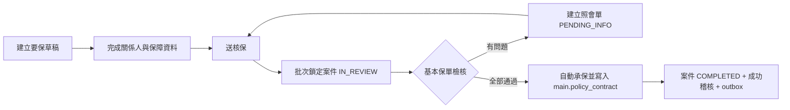

# 新契約核保需求

## 範圍與證據

| 項目 | 內容 | 證據 |
|---|---|---|
| 目標 | 建立新契約要保資料，送交核保，承保後建立正式保單 | Confirmed：使用者需求 |
| 新資料庫 | MySQL schema 使用 `new_contract`；`new-contract` 保留作模組名稱 | Inferred：避免 MySQL identifier 必須加反引號 |
| 正式保單 | 核保承保時寫入 `main.policy_contract` | Confirmed：使用者需求 |
| 適用地區、商品、核保門檻 | 尚未提供 | Unknown |
| 保單號碼配置方式 | 尚未提供，不在資料庫自行猜測 | Unknown |

## 角色

- 要保作業人員：建立、修改草稿與送核保。
- 新契約批次承保作業：領取待處理案件、執行基本檢核、建立照會或自動承保。
- 核保人員：處理照會、檢視例外案件與必要的人工決定。
- 系統整合身分：以 outbox 發送保單建立完成事件。
- 法遵／商品管理人員：核准決策表、商品版本與資料保存期限。

## 核心流程

## 狀態與決定

流程狀態與核保決定分開保存。公開資料可確認臺灣壽險的新契約作業包含收件、資料完整性檢核、
核保、補正、承保結果與保單製發，但金管會要求各保險業者自行建立內部核保制度，未公布共通的
兩碼系統代碼。因此下列兩碼是本系統內碼，不宣稱為金管會或壽險公會標準，正式上線前仍須由
業務與法遵核准：

| 類型 | 代碼 | 中文名稱 | 證據等級 |
|---|---|---|---|
| 共用處理狀態 | `P` | 處理中／受理 | Confirmed（本系統核准碼） |
| 共用處理狀態 | `S` | 完成／結案 | Confirmed（本系統核准碼） |
| 共用處理狀態 | `R` | 照會中／退回補正 | Confirmed（本系統核准碼） |
| 共用處理狀態 | `C` | 取消／退件不續辦 | Confirmed（本系統核准碼） |
| 共用處理狀態 | `W` | 等待／警示 | Confirmed（本系統核准碼） |
| 核保階段 | `NP/AS/NS/DS/CS/NR/NW` | 核保處理／承保完成／拒保完成／延期完成／取消完成／退回／等待 | Confirmed（完成狀態第二碼固定 `S`） |
| 照會階段 | `UP/US/UR/UC/UW` | 照會處理／完成／退回／取消／等待 | Confirmed（第一碼作業、第二碼狀態） |
| 公會索引 | `LP/LS/LR/LC/LW` | 通報系統查詢處理進度 | Confirmed（本系統內碼） |
| 批次排程 | `BP/BS/BR/BC/BW` | 批次處理／完成／退回／取消／等待 | Confirmed（本系統核准碼） |
| 保單製發 | `PP/PS/PR/PC/PW` | 製單處理／完成／退回／取消／等待 | Confirmed（本系統核准碼） |

> 核保階段回答「案件處理到哪裡」，核保決定回答「風險是否承接」；兩者不得共用同一欄位。

批次只領取 `PW` 待發單、指定執行日相同且排程處理狀態為 `W` 的案件。領件後為 `P`；
成功建立 `main` 正式保單主檔後為 `S`，需補正則為 `R`。保單號碼於案件建立時配置並固定，
不使用預編保單號碼，也不得在批次重新取號。

### 臺灣公開來源

- [金管會：保險業招攬及核保理賠辦法](https://law.fsc.gov.tw/LawContent.aspx?id=FL006828)：要求保險業建立內部核保處理制度及程序，未指定共通系統碼。
- [中華郵政：新契約處理流程](https://www.post.gov.tw/post/internet/Insurance/index.jsp?ID=4010203)：可確認資料檢視、補正、核保、拒／緩保、部分承保、承保與製發保單等作業節點。

## 業務規則

- `BR-001`：要保申請、核保案件與正式保單是三個生命週期；承保完成前不得建立正式保單。
- `BR-002`：同一要保書最多一個未完成核保案件，由 DB unique constraint 保證。
- `BR-003`：`CONDITIONAL` 必須至少有一筆結構化核保條件；不得只寫備註。
- `BR-004`：`APPROVE`／`CONDITIONAL` 必須取得唯一保單號碼，並在同一交易完成主檔、案件狀態、成功稽核及 outbox。
- `BR-005`：`POSTPONE`／`DECLINE` 不建立 `main.policy_contract`。
- `BR-006`：核保決定使用 expected status 與 `record_version`，affected rows 為 0 時回傳 HTTP 409。
- `BR-007`：重送同一 `idempotencyKey` 必須回傳原結果，不得建立第二張保單。
- `BR-008`：健康、身分及財務資料不得寫入一般 Log、稽核快照或 outbox payload。
- `BR-009`：批次基本檢核至少包含必填欄位、金額非負、申請日／預定生效日關係、商品代碼與版本存在且有效、幣別一致、要保人與被保險人存在，以及重複要保／保單控制。
- `BR-010`：任何檢核結果為 `FAIL` 或缺少必要規則資料時，不得承保；依失敗結果建立一張照會單及多筆照會項目。
- `BR-011`：照會補正後以新 revision 重新送件；原檢核結果及照會內容 append-only，不覆寫歷史。
- `BR-012`：批次以小批量 chunk 處理，每件申請獨立交易；單件失敗不得 rollback 其他已完成案件。

## 臺灣基本核保控制

以下是流程控制，不是自動承保的風險門檻。來源查核日期為 2026-08-08；正式上線仍須由法遵確認適用商品與最新版本。

| Rule ID | 批次檢核 | 未通過處理 | 依據／限制 |
|---|---|---|---|
| `TW-NB-001` | 要保文件的基本資料、投保內容、告知事項、聲明事項、簽章及招攬報告完整 | 照會補齊文件 | 人身保險核保實務處理準則；具體必填依核准要保書版本 |
| `TW-NB-002` | 要保人、被保險人與受益人角色資料完整，並保存要保書版本 | 照會補正 | 人身保險要保書示範內容及注意事項 |
| `TW-NB-003` | 健康／醫療及個資蒐集處理利用同意、聲明事項已由當事人確認 | 照會取得有效同意 | 要保書示範內容及注意事項；不得只用 UI checkbox 取代合法簽章證據 |
| `TW-NB-004` | 要保人對被保險人的保險利益已確認 | 照會關係或證明文件 | 人身保險核保實務處理準則；特殊關係須人工判斷，不由字串關係碼直接承保 |
| `TW-NB-005` | 商品代碼／版本在申請日及預定生效日有效，投保內容符合該核准商品規則 | 照會或拒絕處理 | 保險業招攬及核保理賠辦法要求公司訂定核保準則；門檻必須來自公司核准商品規則 |
| `TW-NB-006` | 保險需求、險種、保額、保費支出及適合度評估完成；外幣商品另確認匯率風險承受能力 | 照會／人工覆核 | 保險業招攬及核保理賠辦法第 7 條 |
| `TW-NB-007` | 保險通報系統查詢完成，累計件數／保額／保費資料已取得 | 缺資料即照會或暫停，不得僅靠通報結果拒保 | 同辦法第 7 條及要保書聲明事項；通報只作核保參考 |
| `TW-NB-008` | KYC、身分驗證、制裁／洗錢防制與資金來源控制完成 | 暫停承保並交法遵流程 | 適用細節由公司 AML/CFT 規章及最新法令配置，不在程式硬編金額 |
| `TW-NB-009` | 高額、高齡或財務相當性條件命中時，所需財務、職業、健康及強化覆核證據完整 | 建立照會並轉人工核保 | 保險業招攬及核保理賠辦法與相關自律規範；高額／高齡門檻由正式規則版本提供 |
| `TW-NB-010` | 首期保費付款人及支付工具身分／關係證據符合適用規範 | 照會付款授權或關係證明 | 壽險公會身分驗證機制；僅在已選付款方式時執行 |

### 不得寫死的項目

投保年齡上下限、免體檢額度、BMI、職業級別、保額／收入倍數、高額契約門檻、保費負擔比例、體檢項目、再保險門檻及可承保疾病，必須由「商品版本＋核准規則版本＋生效期間」提供。缺少規則資料視為檢核問題並產生照會／人工工作，不得預設通過。

### 正式來源

- 保險業招攬及核保理賠辦法第 7 條：https://law.lia-roc.org.tw/Law/Article?lawno=7&lsid=FL006828
- 人身保險要保書示範內容及注意事項：https://law.lia-roc.org.tw/Law/Content?lsid=FL006767
- 人身保險核保實務處理準則及職業道德規範：https://law.lia-roc.org.tw/Law/Content?lsid=FL040402
- 強化保險業透過信用卡或金融機構轉帳扣款收取保險費之身分驗證機制：https://law.lia-roc.org.tw/Law/Content?lsid=FL094712

## 交易邊界

單件批次交易固定順序：鎖定待處理申請 → 轉 `IN_REVIEW` → 執行並保存規則結果 → 有問題則回寫申請 `FAIL`、建立照會單與項目並轉 `PENDING_INFO`；無問題則回寫申請 `PASS` → 完成核保案件 → 配置保單號碼 → insert `main.policy_contract` → 寫成功稽核與 outbox → commit。上述步驟屬同一交易，任何一步失敗全部 rollback。

## API 契約

| API | 用途 | 主要結果 |
|---|---|---|
| `POST /api/v1/new-contract/applications` | 建立草稿 | applicationNo、狀態、version |
| `POST /api/v1/new-contract/applications/{applicationNo}/submit` | 送核保 | underwritingCaseNo、狀態 |
| `GET /api/v1/new-contract/underwriting-cases/{caseNo}` | 查核保案件 | 申請摘要、條件、決定、version |
| `POST /api/v1/new-contract/underwriting-cases/{caseNo}/decisions` | 核保決定 | 決定、狀態；承保時回 policyNo |

所有回覆使用 `ResponseBodyDto<T>`。命令 API 要求 `Idempotency-Key`；核保決定另要求 expected `recordVersion`。

## 驗收條件

- `AC-001`：要保送件後只建立 `new_contract.underwriting_case`，主檔不存在。
- `AC-002`：承保成功後 `main.policy_contract` 恰有一筆，且申請、核保、稽核、outbox 同時完成。
- `AC-003`：拒保及延期不建立保單。
- `AC-004`：重複命令、版本衝突及重複保單號碼均回 409，且沒有部分寫入。
- `AC-005`：附條件承保缺少結構化條件回 422。
- `AC-006`：正式個資不出現在 Log、稽核與測試資料。
- `AC-007`：任一基本檢核失敗會建立一張照會單及對應項目，且主檔維持零筆。
- `AC-008`：全部基本檢核通過才自動承保；重跑不會重複照會或建立第二張保單。

## 上線前待確認

1. `main.policy_contract` 真實 DDL、必填欄位、主鍵、狀態與 MyBatis mapping。
2. 保單號碼由哪個系統配置，以及失敗／重送契約。
3. 商品版本、費率、財務與醫務核保 decision table。
4. 要保人、被保險人、受益人及保障資料的正式來源與快照欄位。
5. 適用地區、法遵依據、健康資料授權與保存期限。
